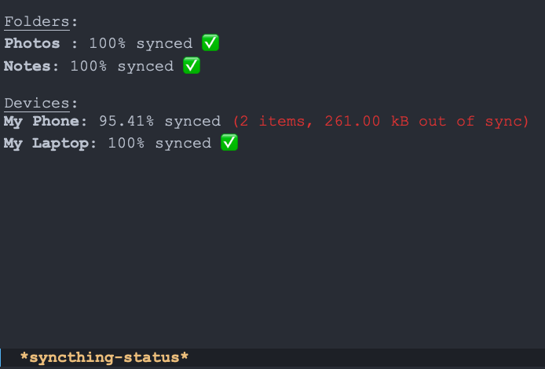

# syncthing-status.el
Elisp to quickly get sync status of folders and devices on Syncthing. Uses the [Syncthing REST API](https://docs.syncthing.net/dev/rest.html) and [request](https://github.com/tkf/emacs-request/tree/master) package to get this data and display it in an Emacs buffer.

## Usage
### Step 1: Installation
You can clone/download this repository and paste `(load "/path/to/syncthing-status.el")` in your init file or copy the contents of `syncthing-status.el` to your init file.
(init file = `~/.emacs.el`, `~/.emacs`, `~/.emacs.d/init.el`, `~/.config/emacs/init.el`, `~/.spacemacs`, `~/.doom.d/config.el` etc.)

### Step 2: API Key
Either use the customize interface or edit the code to set your Syncthing API key as the value to the `syncthing-api-key` variable. The API key can be found in the Syncthing GUI (default http://localhost:8384) under top-right corner Actions > Settings > General > API Key.

### Step 3: Use the function
Run `M-x syncthing-status` to get a window with the sync status of all your folders and devices. If a folder or device is out of sync, the number of items out of sync and the size of these items is displayed next to the sync percentage. The UI is very simple and looks like the screenshot below.

